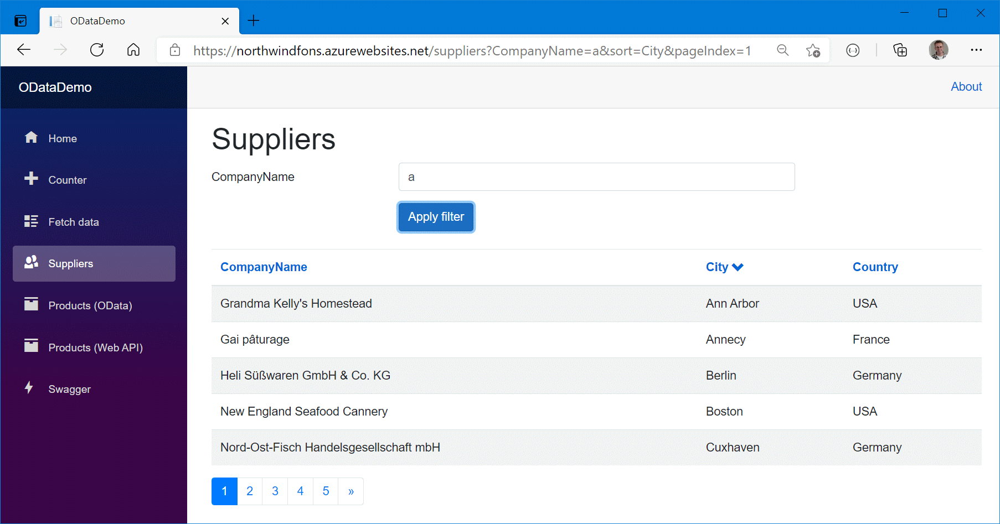

ReflectionIT.Blazor.Paging
===========

Paging solution for Blazor WebAssembly using OData or Web API

## <a id="about">Why ReflectionIT.Blazor.Paging?</a>
Paging is a very common pattern in Web Applications. Most paging solutions I found for Blazor are related to a DataGrid. This is not what I wanted. So I created my own solution which only supports paging including filtering and sorting. It uses OData or a Web API to retrieve the data from a server. It is loosly based on the [ReflectionIT.MVC.Paging](https://github.com/sonnemaf/ReflectionIT.Mvc.Paging) solution which I developed many years ago.

# Live Demo
Try this [live demo](https://northwindfons.azurewebsites.net/). It uses OData endpoints for Suppliers and Products and a Web API endpoint for Products, see [Swagger UI](https://northwindfons.azurewebsites.net/swagger). The data is stored in a Northwind database on Azure. You can only read the data. Insert, Update and Delete will give you a 500 statuscode.

## <a id="features">What's in the box</a>
Information on what's contained within this package will be coming soon. Please check back later.

## NuGet packages

| Package | Version |
| ------ | ------ |
| ReflectionIT.Blazor.Paging |  |

## <a id="contributing">Contributing</a>
Everyone is welcome to contribute. If you find an issue, please could you raise it in the [issues](https://github.com/sonnemaf/ReflectionIT.Blazor.Paging/issues) section or it would be fantastic if you could have a look at rectifying the issue and submitting a pull request. 

If you're looking to help out with the project, issues may be a great place to start. I'll actively monitor and review issues to make sure that quality is driven through the  project.

### Getting started
The project has been primarily built for Blazor WebAssembly, so you'll need the latest version of [Visual Studio 2019](https://www.visualstudio.com) (including the community edition or VS Code) 

## <a id="license">License</a>
ReflectionIT.Blazor.Paging is made available under the [MIT License](LICENSE).
